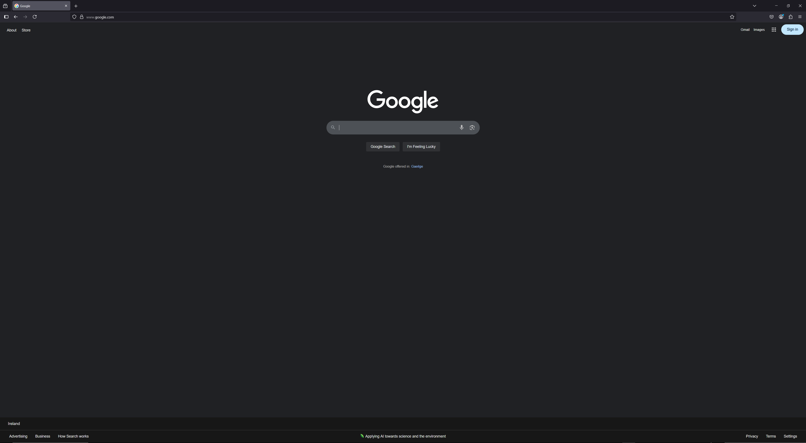

I'm sure y'all came across these themes in the firefox store that look like they can change your firefox into internet explorer, but they don't do shit. So you wonder: "Is there any way I can make my boring firefox look like internet explorer like windows 7 used to have?"

The answer is: yes, now you can. I made a IE8 skin for the latest version of firefox. Some other Repos have skins that are only for the outdated versions of firefox and are never being updated. Today, I saved every old-school people with this pack of .css codes.

# Instructions
## Pre-preparation (IMPORTANT!!)
Disable ANY themes in about:addons as it is guaranteed it WILL break firefox. If there are any extensions modifying the theme, disable these too.

## Installation
First, install the repository, obviously. There are 2 methods to grab this repository.
- Method 1: Download it as a ZIP file. Simple enough.
- Method 2: Use Git Bash for Windows and type this command:

```
git clone https://github.com/marshmellodie/IE8-skin-for-Firefox.git
```

Next, go to about:support in Firefox to locate your profile folder.

It should look something like this.


Open it and then copy the chrome folder from this repository and paste it into that profile directory.


Going back to Firefox, type 'about:config' in the url bar. If you get a warning message, click on accept and continue.

Next, type 'toolkit.legacyUserProfileCustomizations.stylesheets' and set it to True.


After this, restart firefox. The theme will apply.

When you reopen, it will obviously look like a piece of unorganized garbage. You'll have to customize it by right clicking on the tab bar and customizing the toolbar. I recommend turning Title Bar on, as it gives you more of a IE vibe. You can also disable smooth scrolling in the Firefox settings for even better, more XP-like vibe.

# Notice
This skin is still in development. When typing in the Url bar, it will severely stretch out. I'm trying to fix this atm. No, I'm not gonna make older IE skins. I know that this skin may not accurate to the actual Internet Explorer, but I tried my best.

You CAN change the branding of the executable with Resource Hacker, but I don't really recommend it as there's a 50/50 chance that Windows Defender (or any other antivirus you have) may flag the modified firefox.exe as sus.

Before


After


Have fun! If there are some bugs, lmk. This may be frequently updated, so be sure to update the look.